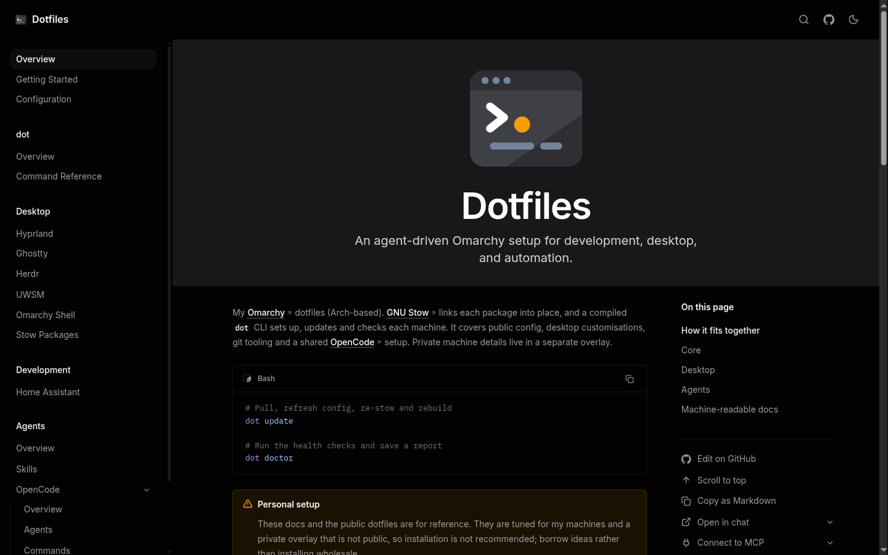
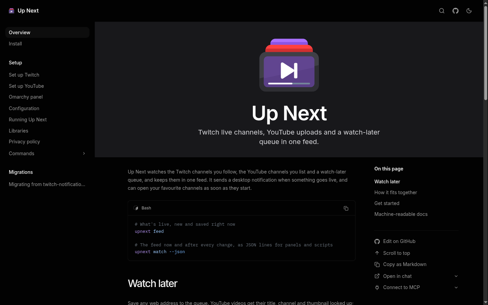
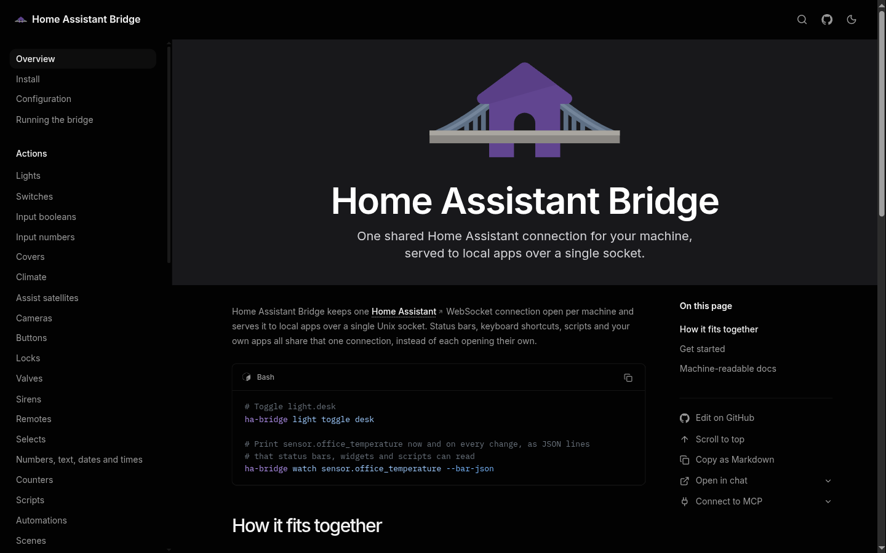
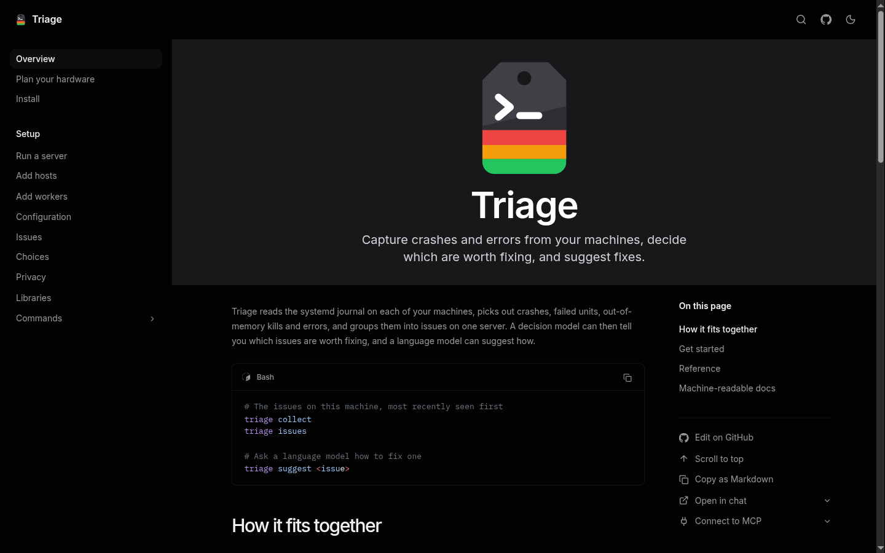

# docs-kit

Shared branding, layout and config for my documentation sites, published as
[`@timmo001/docs-kit`](packages/docs-kit/README.md) on npm and JSR.

## Sites using it

| [dotfiles.timmo.dev](https://dotfiles.timmo.dev)                                    | [upnext.timmo.dev](https://upnext.timmo.dev)                                |
| ----------------------------------------------------------------------------------- | --------------------------------------------------------------------------- |
| [](https://dotfiles.timmo.dev)    | [](https://upnext.timmo.dev) |
| [ha-bridge.timmo.dev](https://ha-bridge.timmo.dev)                                  | [triage.timmo.dev](https://triage.timmo.dev)                                |
| [](https://ha-bridge.timmo.dev) | [](https://triage.timmo.dev)  |

## Agent skill

[The docs-kit skill](skills/docs-kit/SKILL.md) guides agents setting up or
changing a docs site with the package. Install it with:

```sh
npx skills add timmo001/docs-kit
```

Or import the `skills/docs-kit/` directory unchanged into your skill collection.

## Development

The package lives in `packages/docs-kit`. Use the tool versions pinned in
[mise.toml](mise.toml) and Bun for dependencies.

```sh
mise run install
mise run check
```

The package ships TypeScript, Astro and CSS source, so there's no build step.
To try a change in a site, pack it with `npm pack` in `packages/docs-kit` and
install the tarball there. A linked or `file:` install points Vite at the
source path, which breaks Astro's style compilation.

## Releases

Before the first automated publication, configure npm trusted publishing for
`timmo001/docs-kit` with workflow filename `release.yml`, and link the JSR
package to the repository. An initial npm publication may be needed before
trusted publishing is available.

For a release, set the same version in `packages/docs-kit/package.json` and
`packages/docs-kit/jsr.json`, keep `bun.lock` in sync and pass `mise run check`.
Commit and push, then publish a GitHub release with a tag matching the version
exactly, such as `0.1.0`. The release workflow checks the tag against both
versions, validates the package and publishes it to npm with provenance and to
JSR.
